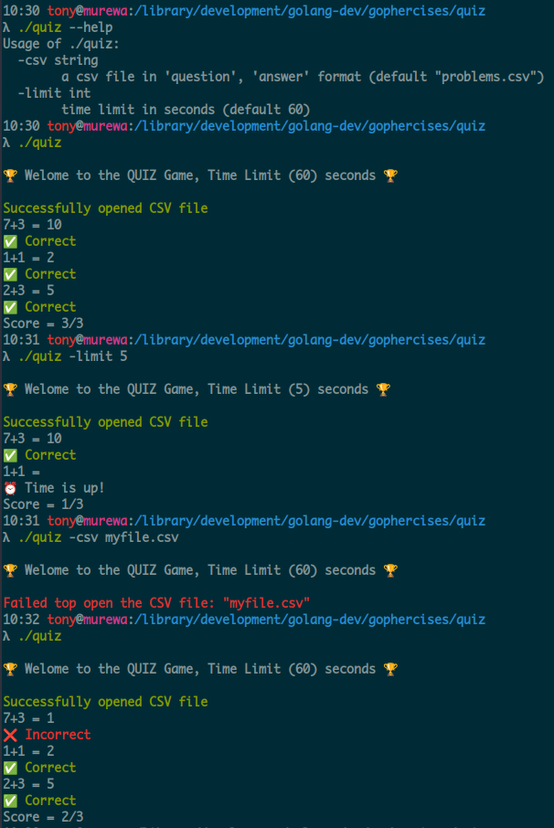

## Quiz

**quiz reads questions and answers from a CSV file, displays one question at a time and prompt the user for an answer**

The program illustrates the basic use of [{channels}](https://gobyexample.com/channels) timeouts [{timer}](https://pkg.go.dev/time#Timer), [{flag}](https://pkg.go.dev/flag) command line argument parsing, printing text in different colors and reading [{CSV}](https://pkg.go.dev/encoding/csv) files

### TODO - Unit Tests

---

